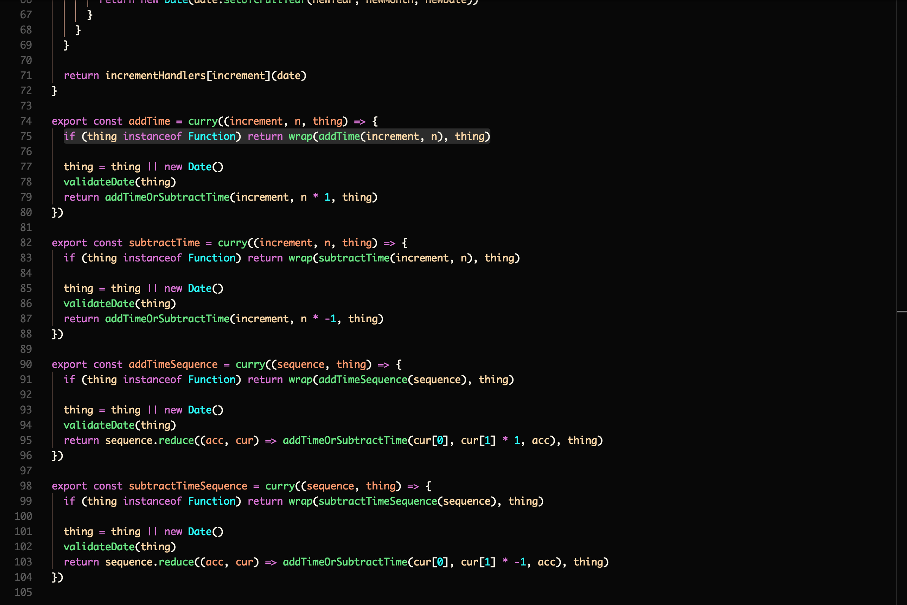
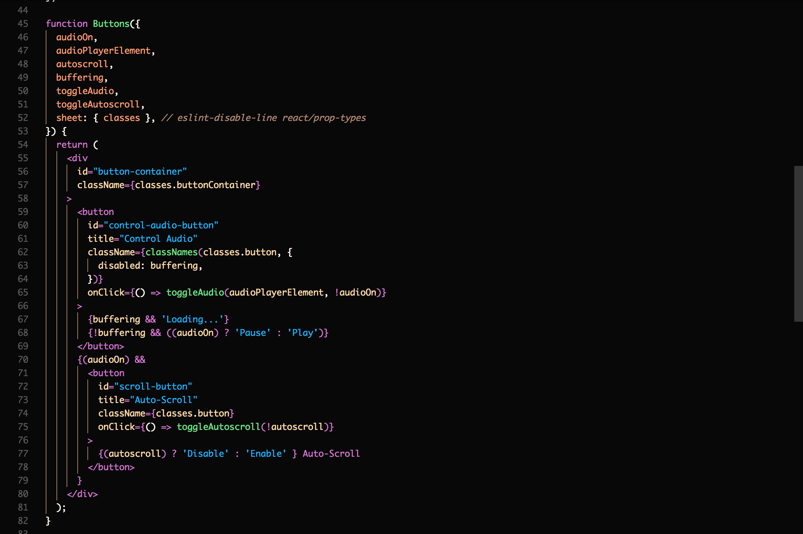
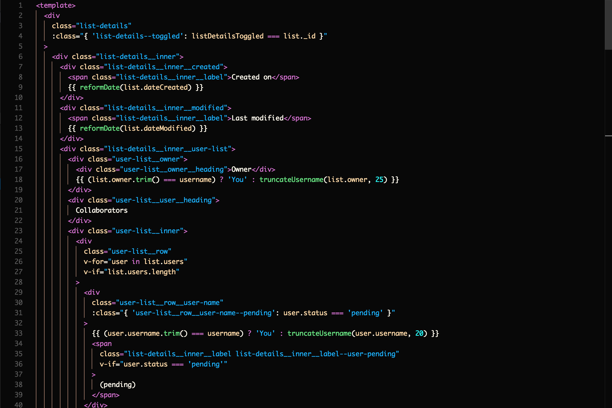
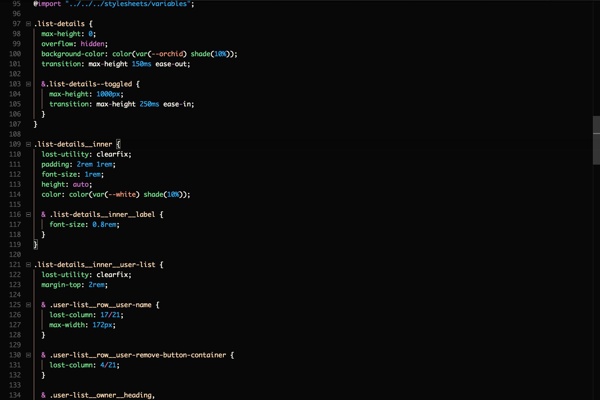
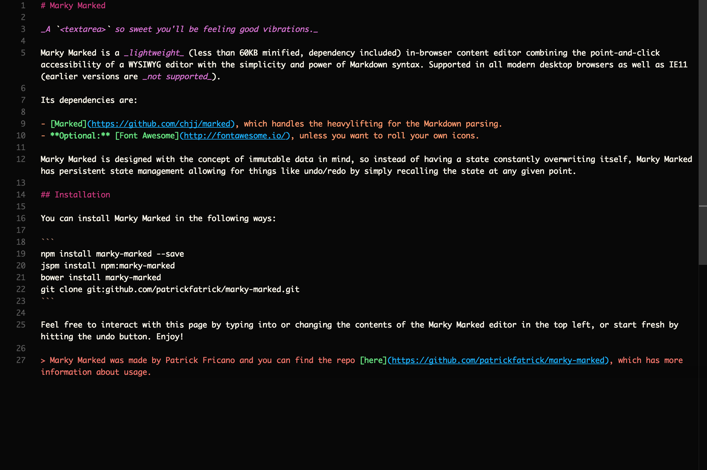

# README

This is a theme I've been using for years in Sublime and now that I'm using VSCode on the regular, I've ported it for use here. It's intended to be a pleasant, readable, beautiful theme. YMMV on that of course :)

I've written it especially for the technologies that I tend to use, so we're looking at JS, Vue, React, CSS, Ruby/Rails, Haml/Pug, Java, and maybe PHP but it's been a while. You may have to download syntax extensions to get the most out of this (namely the Language Support for Java, Ruby, vetur, postcss-sugars, and the Babel ES6/ES7 extensions).

It's still under pretty active development as I'm new to VSCode, but quickly stabilizing.

## Theme colors

`#FF9A69 #B28773 #262626 #FFDAA5 #E84D49 #DA70D6 #63E87F #FFFAED #00B0FF #00FFFF`

### JS

### JSX

### Vue Template

### CSS

### Markdown

